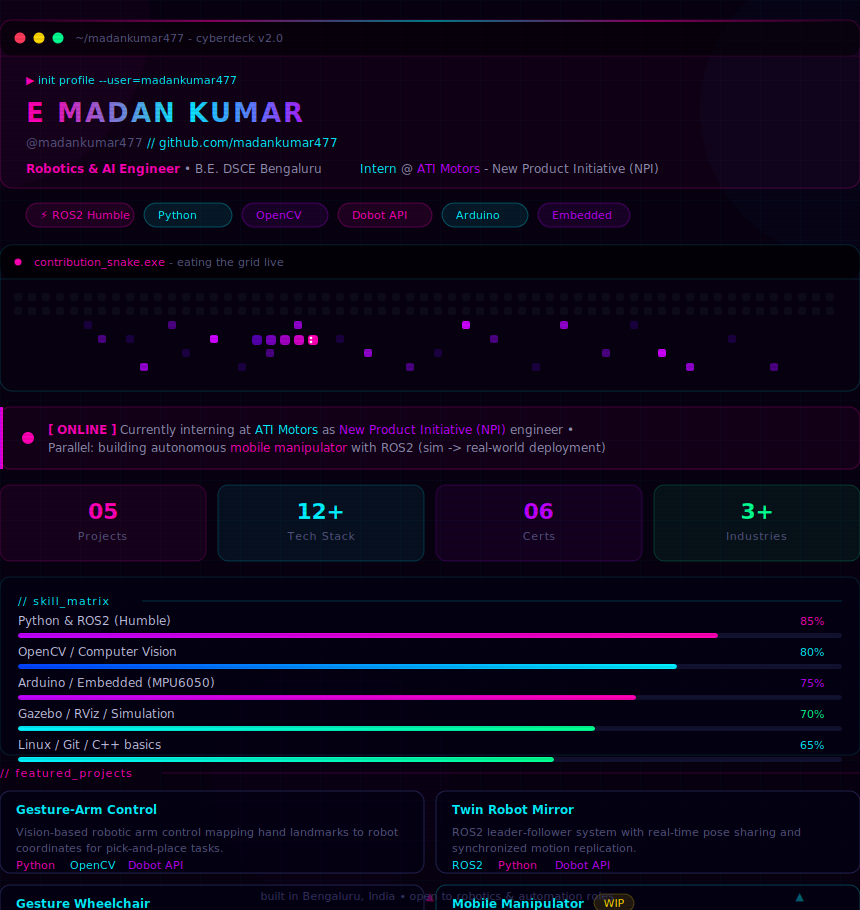

 

---

## &#128736; Tech Stack

---

## &#128202; GitHub Stats

---

## &#128200; Activity Graph

---

## &#127942; GitHub Trophies

---

## &#128013; Contribution Snake

---

## &#128235; Connect

- &#128231; mk6360363552@gmail.com
- &#128188; LinkedIn: *(add your profile URL here)*

> **Always Building &bull; Always Learning &bull; Always Shipping**
