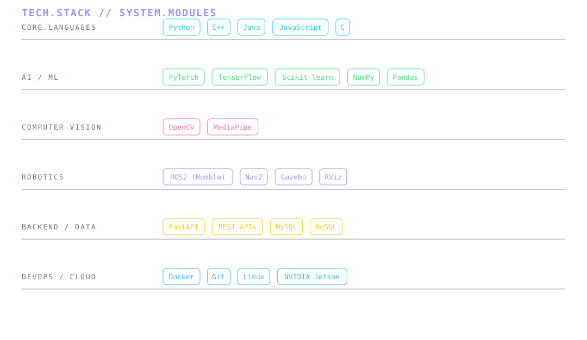

<div align="center">



<br/>


</div>

<br/>

<!-- =========================================================
     02 // DEVELOPER IDENTITY + 03 // SYSTEM INFORMATION
     ========================================================= -->



<br/>

<!-- =========================================================
     04 // TECH STACK
     ========================================================= -->



<br/>

<!-- =========================================================
     05 // FEATURED SYSTEMS
     ========================================================= -->


<p align="center">
  <sub>Full source for public builds → <a href="https://github.com/madankumar477?tab=repositories">github.com/madankumar477 → Repositories</a></sub>
</p>

<br/>

<!-- =========================================================
     06 // GITHUB ANALYTICS
     ========================================================= -->

<div align="center">

### 📊 GITHUB.ANALYTICS


</div>

<br/>

<!-- =========================================================
     07 // ALGORITHM PROTOCOL / LEETCODE
     ========================================================= -->

<div align="center">

### 🧠 ALGORITHM.PROTOCOL

</div>

```yaml
leetcode_sync        : ONLINE
solutions_repository : ACTIVE   → github.com/madankumar477/leet-code
language              : Python
dsa_training          : ACTIVE  → data structures · algorithms · problem solving
```

<p align="center">
  <a href="https://github.com/madankumar477/leet-code">
    
  </a>
</p>

<p align="center"><sub>Solutions are committed directly to the repo above as problems are solved — no fabricated stats, just the real log.</sub></p>

<br/>

<!-- =========================================================
     08 // CONTRIBUTION MATRIX
     ========================================================= -->

<div align="center">

### 📈 CONTRIBUTION.MATRIX

<picture>
  <source media="(prefers-color-scheme: dark)" srcset="https://raw.githubusercontent.com/madankumar477/madankumar477/output/github-contribution-grid-snake-dark.svg" />
  <source media="(prefers-color-scheme: light)" srcset="https://raw.githubusercontent.com/madankumar477/madankumar477/output/github-contribution-grid-snake.svg" />
  
</picture>

<sub>Auto-generated daily by <code>.github/workflows/snake.yml</code> — eats through the real contribution graph.</sub>

</div>

<br/>

<!-- =========================================================
     09 // CURRENT PROCESSES
     ========================================================= -->


<br/>

<!-- =========================================================
     10 // CONNECT
     ========================================================= -->

<div align="center">

### 📡 ESTABLISH_CONNECTION

<a href="https://github.com/madankumar477"></a>
<a href="https://linkedin.com/in/emadankumar"></a>
<a href="mailto:mk6360363552@gmail.com"></a>

<br/><br/>

<sub>⚡ Always Building · Always Learning · Always Shipping ⚡</sub>

</div>
